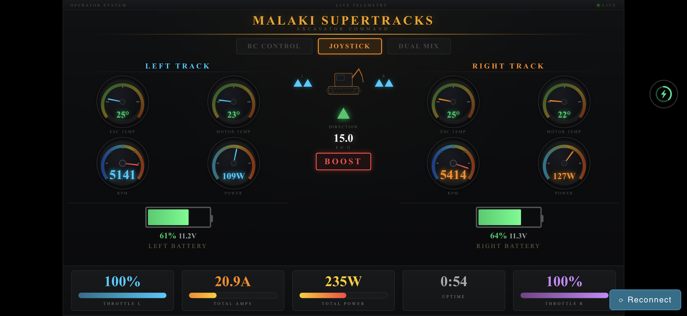

# 🚜 Excavator Track Controller

**Tank-style dual-track controller for a ride-on excavator, built on the
Arduino UNO R4 WiFi.** Two FOC brushless motors drive rubber tracks. Two people
can drive it — an RC transmitter operator and a seated rider on a joystick — and
a 3-position switch decides who has authority. Live motor telemetry streams to a
Wi-Fi dashboard you open on your phone.

> The controller's job is deliberately small and predictable: **read the inputs,
> shape them, mix them into left/right track commands, cap them by gear, and send
> a servo-PWM throttle to each ESC.** The ESC's internal FOC owns motor smoothness,
> so there is no closed-loop control or lag on the Arduino side.

---

## ✨ What It Can Do

- **Tank / curvature mixing** — one stick (or wheel + trigger) blends into smooth
  left/right track control; counter-rotating **pivot turn** on the spot at a standstill.
- **Two drivers, one machine** — RC transmitter *and* a rider joystick, with a
  3-position override switch (RC-only / RC-priority / 50-50 blend).
- **Gear caps** — Eco / Normal / Turbo wheel-speed limits selectable from the remote.
- **Exponential response curves** — separate throttle and steering expo for fine,
  controllable low-speed handling.
- **Instant failsafe** — loss of the RC signal holds both tracks at neutral.
- **Live Wi-Fi telemetry dashboard** — per-track voltage, current, RPM, power,
  ESC/motor temperatures and battery state, served straight off the board
  (monitoring only — there is no control over Wi-Fi, by design).

---

## 🧰 Uses (Hardware)

| Part | Model | Notes |
| --- | --- | --- |
| **Controller** | **Arduino UNO R4 WiFi** | Renesas RA4M1 (48 MHz, 14-bit ADC, 5 V-tolerant) + onboard ESP32-S3 for Wi-Fi. *(This project ran on a Nano R4 earlier — it does not anymore.)* |
| **ESC ×2** | XC **GL10 80A FOC** | Standard 50 Hz servo-PWM input, internal field-oriented control, IP67. |
| **Motor ×2** | XC **GL540L** | Sensored brushless, paired to the GL10 — one per track. |
| **Battery ×2** | OVONIC 3S LiPo 15000 mAh 130C | 11.1 V, EC5 — one pack per side. |
| **RC system** | Radiolink RC6GS V3 + R7FG | 6-channel gun-style radio over S.BUS (trigger = throttle, wheel = steering). |
| **Joystick** | Genie 101174GT dual-axis | 5 V, 0–5 V analog hall-effect, wired straight to the ADC. |

The Arduino reads everything, does the tank mixing itself, and outputs a servo
PWM throttle (1000–2000 µs) per track on D9/D10. Full wiring lives in
[`docs/WIRING-GUIDE-V8.md`](docs/WIRING-GUIDE-V8.md).

---

## 🎮 Controls

### RC transmitter (supervisor)

- **Trigger = throttle, wheel = steering** — the Arduino mixes these into the two
  tracks.
- **3-position switch (CH5)** selects the override mode (below).
- **Gear switch (CH4)** selects Eco / Normal / Turbo.
- Moving the controls takes priority over the joystick in RC-priority mode, so the
  supervisor can always step in.

### Joystick (rider)

The rider drives with a single dual-axis stick:

| Stick | Result |
| --- | --- |
| **Forward** | Both tracks forward — drive straight ahead |
| **Back** | Both tracks reverse |
| **Right** | Left track forward + right track back — turn right |
| **Left** | Right track forward + left track back — turn left |
| **Diagonal** | Blends forward/back with turning (curvature drive) |
| **Right/left at a standstill** | **Pivot turn** — tracks counter-rotate on the spot (capped at 60%) |

A deadband around center keeps the machine still when the stick is released, and
an expo curve makes small movements gentle for precise maneuvering. The
joystick throttle also carries a slight boost (×1.05) so it doesn't feel weaker
than the RC throttle — full deflection still tops out at the active gear cap.

### Override modes (3-position switch)

| Mode | Switch | Who drives |
| --- | --- | --- |
| **RC only** | Down | Supervisor has full control; joystick ignored |
| **RC priority** | Middle | Rider drives on the joystick; supervisor takes over instantly by moving the controls, hands back when centered |
| **50/50 blend** | Up | Both inputs averaged together — shared control |

### Gear caps (gear switch)

The gear sets the **average (straight-line) speed cap** — not a per-wheel limit.
In a turn, Eco and Normal let the *outer* track climb into the headroom up to the
ESC rail, so the machine **holds its speed through corners** instead of bogging
down. Boost is already at the rail, so it has no extra turn headroom.

| Gear | Straight-line cap | Use |
| --- | --- | --- |
| **Eco** | 65% | Training / tight spaces (~35% turn headroom; reverse & pivot get extra authority) |
| **Normal** | 80% | Everyday driving (~20% turn headroom) |
| **Boost** | 100% | Full authority (at the rail — no turn headroom) |

Reverse is capped to 50% of forward stick travel (62.5% in Eco), and pivoting in
place is capped at 60% (72.5% in Eco) — all gear-scaled.

---

## ⚡ Power & Drivetrain

Each track is an independent power unit: a **GL540L** sensored brushless motor
driven by a **GL10 80A FOC** ESC, fed from its own **3S LiPo** pack.

- **Field-oriented control inside the ESC** — the GL10 turns the Arduino's PWM
  command into smooth phase currents with its own acceleration ramp and drag
  handling. The Arduino sends *what we want*; the ESC decides *how to spin the
  motor* to get there. No jerky starts, no Arduino-side PID.
- **80 A per ESC, IP67** — plenty of current headroom for a ~50 lb ride-on machine,
  and sealed against dust and water.
- **Dual 15000 mAh 130C packs** — high-discharge LiPos sized for sustained track
  loads; one per side keeps the two drivetrains electrically independent.
- **Open-loop by design** — the Arduino does **not** read RPM and correct the
  throttle. Stick position → PWM → ESC executes. Telemetry is read *only* for the
  dashboard and never feeds back into motor output (a permanent safety decision).

---

## 📡 Wi-Fi Telemetry Dashboard

The board hosts its own Wi-Fi access point (`Digger-Telemetry`) at
`192.168.4.1`. Connect a phone and the dashboard streams live data over
Server-Sent Events at ~5 Hz:



- Per-track **voltage, current, power, RPM**, and **ESC + motor temperatures**
- **Battery state** for each pack
- Active **drive mode**, **gear**, and per-track **throttle/direction**

It's a **single-page app** that fits landscape on an iPhone or Android phone — no
app install, just connect to the AP and open the page (it can also be saved to
the home screen for a full-screen, browser-chrome-free view).

It's **monitoring only** — there is no path from Wi-Fi to the motors, ever. The
dashboard source is mirrored in [`dashboard/index.html`](dashboard/index.html).

---

## 🔧 Build & Upload

Board: **Arduino UNO R4 WiFi** · FQBN: `arduino:renesas_uno:unor4wifi`

```bash
# Compile
arduino-cli compile --fqbn arduino:renesas_uno:unor4wifi sketches/rc_test

# Upload (serial port, e.g. COM7)
arduino-cli upload --fqbn arduino:renesas_uno:unor4wifi -p COM7 sketches/rc_test

# Monitor / live plot
python monitor.py
python live_plot.py
```

---

## 📚 Documentation

| Doc | What's inside |
| --- | --- |
| [`PROJECT-PLAN.md`](PROJECT-PLAN.md) | Full technical specification and pin map |
| [`OPERATOR-GUIDE.md`](OPERATOR-GUIDE.md) | Plain-language guide for the RC operator and the rider |
| [`docs/WIRING-GUIDE-V8.md`](docs/WIRING-GUIDE-V8.md) | Canonical hardware wiring reference |
| [`docs/GL10-PARAMETERS.md`](docs/GL10-PARAMETERS.md) | GL10 ESC parameters with code-context analysis |
| [`docs/XBUS-PROTOCOL.md`](docs/XBUS-PROTOCOL.md) | X.BUS telemetry protocol reference |
| [`docs/DECISION-LOG.md`](docs/DECISION-LOG.md) | Technical decision history |

The main firmware is [`sketches/rc_test/rc_test.ino`](sketches/rc_test/rc_test.ino),
organized into searchable `[MODULE]` sections (`[CONFIG]`, `[DRIVE]`, `[RC]`,
`[JOYSTICK]`, `[GEAR]`, `[MIXER]`, `[OUTPUT]`, `[TELEMETRY]`, `[WIFI]`, `[DEBUG]`).

---

> ⚠️ **Safety:** this drives a real ~50 lb ride-on machine with powerful motors.
> Keep it in line of sight, start in Eco gear, and make sure the supervisor can
> always reach the override switch.
